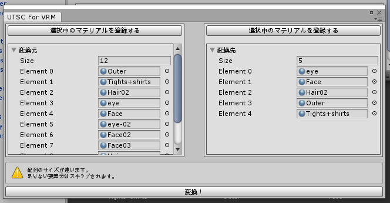
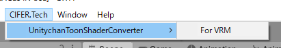

# UnitychanToonShaderConverter
UnitychanToonShaderを使用しているマテリアルのパラメータを、特定のシェーダ／マテリアルに変換するエディタ拡張

  

## 概要
UnitychanToonShader2.0（UTS2）でセットアップされた素敵なモデルをお手頃価格で買えるような時代になりましたが、特定のアプリケーションやサービスに持っていこうとしてもシェーダが制限されている場合があります。  
その時にはシェーダを変更してパラメータを調整しなければならないのですが、イチから手作業でセットアップするのは大変です。  
そこで手軽にセットアップが行えるよう、UTS2から特定のシェーダへパラメータを変換してくれるエディタ拡張を作りました。  
現在はVRMに同梱されているMToonにのみ対応しています。  
要望が多ければ他シェーダにも対応します。  

## 使い方
1. [Booth](https://cifertech.booth.pm/items/1906567)からUnityPackageをダウンロードしてインポートする。
2. プロジェクトのScripting Runtime Versionを __.NET4.x（もしくはそれ以上）__ にする。
3. メニューバーより __CIFER.Tech -> UnitychanToonShaderConverter -> （変換先）__ を選択する。
4. 左側に変換元となるマテリアルを、右側に変換先となるマテリアルを登録する。
5. 一番下に出現する『変換！』ボタンを押下する。

## 動作環境
- Unity2017.4.28f1
  - Scripting Runtime Version Experimental(.NET 4.6 Equivaient)
- [UnitychanToonShader2.0（UTS2）](https://github.com/unity3d-jp/UnityChanToonShaderVer2_Project)

### 変換先シェーダ（必要なもののみ用意ください）
- [UniVRM](https://github.com/vrm-c/UniVRM)
  - [MToon](https://github.com/Santarh/MToon)

## FAQ
### 対応している変換先シェーダは何ですか？
現在はVRMに同梱されているMToonにのみ対応しています。  
要望が多ければ他シェーダにも対応します。

### 変換元と変換先の対応はどうなってるの？
インデックス準拠になっています。  
例えば、変換元Element0に登録されたマテリアルは、変換先Element0に登録されたマテリアルに設定値を変換して上書きします。

### Nullの時の挙動はどうなってるの？
変換元もしくは変換先のマテリアルが何らかの理由でNullの場合は、該当する要素（インデックス）を飛ばして処理を続行します。

### 変換元と変換先でマテリアルの数が違うんだけど
正常に変換できます。ただし設定値のマージ等は行わないので、変換後に再度調整する必要があるかと思います。

## ライセンス
本リポジトリは[MITライセンス](LICENSE)の下で公開しています。

本リポジトリにはMITライセンスの下に提供されている[UniVRM](https://github.com/vrm-c/UniVRM/blob/master/LICENSE.txt)が含まれています。  
本リポジトリにはUCL2.0（ユニティちゃんライセンス2.0）の下に提供されている[UnityChanToonShaderVer2_Project](https://github.com/unity3d-jp/UnityChanToonShaderVer2_Project)が含まれています。  
これらのコンテンツを利用される場合は、該当リポジトリのライセンスもしくは同梱しているライセンスファイルに従ってください。  

  
© Unity Technologies Japan/UCL  
